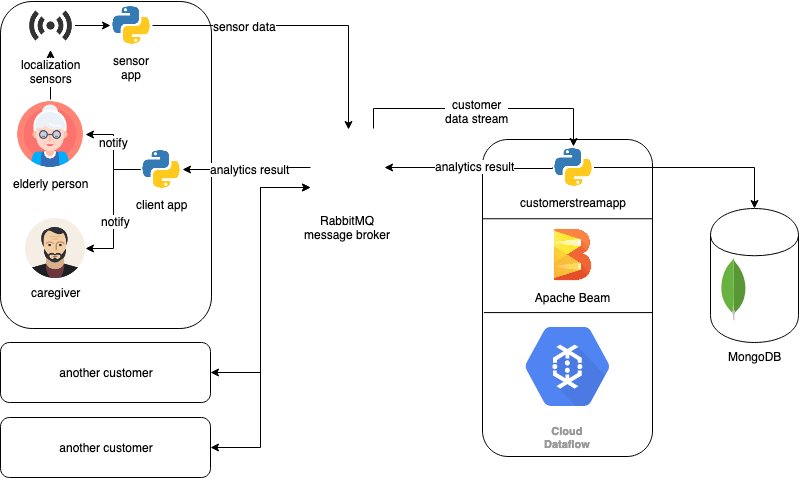

# Assignment 3 – Understanding Big Data Processing

## Part 1 - Design for streaming analytics (weighted factor for grades = 4)

> *1. Select a dataset suitable for streaming analytics for a customer as a running example (thus the basic unit of the data should be a discrete record/event data). Explain the dataset and at least two different analytics for the customer:*
>   * *(i) a streaming analytics which analyzes streaming data from the customer (`customerstreamapp`) and*
>   * *(ii) a batch analytics which analyzes historical results outputted by the streaming analytics. The explanation should be at a high level to allow us to understand the data and possible analytics so that, later on, you can implement and use them in answering other questions. (1 point)*

For this assignment, I decided to continue with the [Indoor Localization Dataset](https://zenodo.org/record/2671590) that I was working on in the previous assignments. 
The dataset consists of the sensor data from eldery people's homes that describes their location and momevent within the home. The data is structured in a CSV file with the following columns:
* `part_id` – a number corresponding to the user ID
* `ts_date` – `YYYYMMDD` formatted date
* `ts_time` – `hh:mm:ss` formatted time
* `room` – room (possible values: `<hall|livingroom|kitchen|bathroom|yard|bedroom|warehouse>`)

Each row describes entering of a specific person (`part_id` field) to a certain room (`room` field) at a specific time (`ts_date` and `ts_time`). An assumption is made that the person stayed in the room until the next (w.r.t. `ts_date` and `ts_time`) datapoint associated with that person.

(i) I am interested in extracting and tracking the information about the duration of stay of different people in different rooms. By tracking this data, the system can send alarms to customers (who might be family members or caregivers of the eldery people) if a person stayed in a particular room for too long. Different rooms and people might have different warning thresholds set. The data can also be used in order to determine whether a person has visited a room within a given time window. For example, if a person A does not visit the room `kitchen` between 11pm and 3pm, the system can send a reminder to have lunch, and if the person does not go there until 5pm, a warning will be sent to their caregiver. Those notifications may be customized for every user

(ii) Additionally, I will track the number of changes of rooms (i.e. "movements") for every person, and the number of people currently staying in a given room, which would be a useful information for the batch analysis later on. ...

> *2. Customers will send data through message brokers/messaging systems which become datastream sources. Discuss and explain the following aspects for the streaming analytics:*
>   * *(i) should the analytics handle keyed or non-keyed data streams for the customer data, and*
>   * *(ii) which types of delivery guarantees should be suitable. (1 point)*

(i) Keyed data streams are useful in case when we want to logically separate the data stream into several substream grouped by key. When analysing the duration of stay in a room for every person, an appropriate choice for a key would be `part_id`. On the other hand, for the aggregation of statistics per room, we can group the data by the `room` key.

(ii) ...

> *3. Given streaming data from the customer (selected before). Explain the following issues:*
>   * *(i) which types of time should be associated with stream sources for the analytics and be considered in stream processing (if the data sources have no timestamps associated withevents, then what would be your solution), and*
>   * *(ii) which types of windows should be developed for the analytics (if no window, then why). Explain these aspects and give examples. (1 point)*

(i) In my streaming (and batch) analytics pipeline, it is cruical to have an associated timestamp for each event (i.e. entering of a room), since the information I extract from data is very much time-dependent (*duration* of stay in a room, *frequency* of movement in a day, tracking of *time-dependent* events like if a person has entered a certain room within a given time period, etc.); my data source has a precise timestamp for every data point given by `ts_date` and `ts_time` fields, although it is important to point out that there might be a difference between the event timespamp (given in the data) and the ingestion timestamp (time when the data entered the system). Since my goal is to monitor the location and movement of the eldery people in near real-time and provide immidiate feedback, it is crucial that the lag between event-time and ingestion-time is relatively small, namely, under 15 minutes, as a bigger lag would mean possible false alarms or worse, late alarms.

(ii) For defining windows, it is important to determine what kind of options are available. There are two main approaches of windowing stream data: time-based and session-based. 
* In the latter approach, windows are defined by special start and end markers present in some data points (which might be key-dependent); the data that comes between those marked data points is considered within a window and processed together. For example, if other data like movement within a room would be recorded, a potentially useful window (for a single person) would be marked by datapoints for entering and leaving a room. However, the chosen dataset does not provide sufficient information in order to make use of the session-based windows.
* The time-based windows are on one hand simpler to implement, since a single window is defined by a time interval. However, those time interval can be fixed and sequential (with no overlap), or sliding (multiple shifted non-overlapping window sequences, each datapoint is included in several windows). For my streaming analytics, a fixed time-based window could be used in order to calculate room popularity statistics, however, because of the event-ingestion time lag (described in the previous point), there is no guarantee on whether the datapoints come in order (w.r.t. event timestamp), hence, I will not use windows for that and leave this work for the batch analytics (those statistics aren't needed in real-time).

> *4. Explain which performance metrics would be important for the streaming analytics for your customer cases. (1 point)*

1. As mentioned before, the lag between the time of an event and the ingestion time of the associated datapoint must be sufficiently small in order to perfom the kind of event-time dependent analytics useful to my customers.
2. Additionally, the processing time is important – there absolutely must not be any large queuing present in the system, since it would cause delayed notifications to the customers.
3. ...

> *5. Provide a design of your architecture for the streaming analytics service in which you clarify: **customer** data sources, **mysimbdp** message brokers, **mysimbdp** streaming computing service, **customer** streaming analytics app, **mysimbdp-coredms**, and other components, if needed. Explain your choices of technologies for implementing your design and reusability of existing assignment works. Note that the result from **customerstreamapp** will be sent back to the customer in near real-time. (1 point)*

The architecture of the analytics service is presented on the following diagram:

The **customer** data sources are sensor firing that get recorded when an elderly person enters a certain room. This data then gets sent (via an AMQP publisher) to the **mysimbdp** message broker which powered by RabbitMQ. The brocker then sends the data stream to the **customer** streaming analytics app built with the Apache Beam unified programming model. The actual processing is executed on Google Cloud Dataflow, which acts as the **mysimbdp** streaming computing service. The analytics results are then sent back to customers via RabbitMQ and additionally ingested to **mysimbdp-coredms** for later batch processing.

...

## Part 2 - Implementation of streaming analytics (weightedfactor for grades = 4)

> *1. Explain the implemented structures of the input streaming data and the output result, and the data serialization/deserialization, for the streaming analytics application (customerstreamapp) for customers. (1 point)*

...

> *2. Explain the key logic of functions for processing events/records in customerstreamapp in your implementation. (1 point)*

...

> *3. Run customerstreamapp and show the operation of the customerstreamapp with yourtest environments. Explain the test environments. Discuss the analytics and its performance observations. (1 point)*

...

> *4. Present your tests and explain them for the situation in which wrong data is sent from or iswithin data sources. Report how your implementation deals with that (e.g., exceptions,failures, and decreasing performance). You should test with different error rates. (1 point)*

...

> *5. Explain parallelism settings in your implementation and test with different (higher) degrees ofparallelism. Report the performance and issues you have observed in your testingenvironments. (1 point).*

<!-- 
Resources

Windowing: https://softwaremill.com/windowing-in-big-data-streams-spark-flink-kafka-akka/
-->

